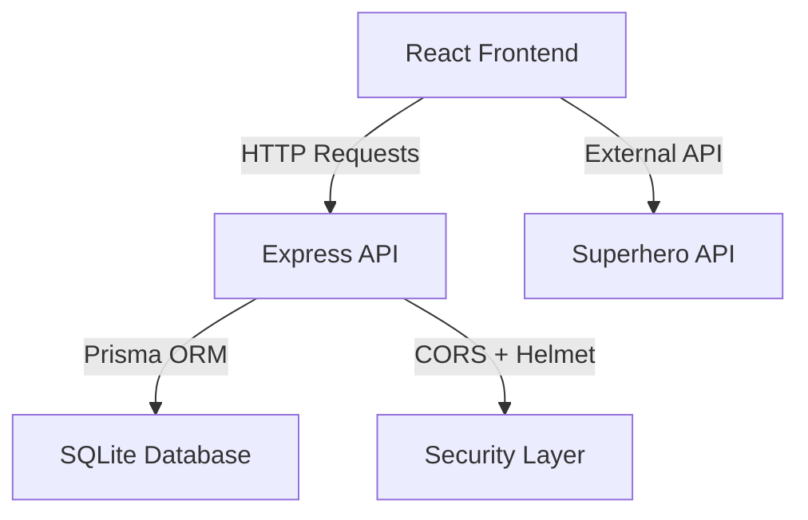

# 🦸‍♂️ HeroSearcher - Professional Portfolio Project

<div align="center">


A modern, full-stack superhero and villain search engine built with industry-standard technologies and best practices.

[Report Bug](https://github.com/enekomb/HeroSearcher/issues) • [Request Feature](https://github.com/enekomb/HeroSearcher/issues)

</div>

---

## 📋 Table of Contents

- [About](#about)
- [Tech Stack](#tech-stack)
- [Quick Start](#quick-start)
- [Architecture](#architecture)
- [Technical Challenges](#technical-challenges)
- [Features](#features)
- [Contributing](#contributing)
- [License](#license)

---

## 🎯 About

HeroSearcher is a professional portfolio project demonstrating modern full-stack development practices. Users can search for superheroes and villains, explore their stats, and manage a personalized favorites list. The application showcases a complete refactor from Firebase to SQLite, implementing industry-standard security practices and clean code principles.

---

## 🛠️ Tech Stack

### Frontend
- **React 18.3.1** - Modern UI library with hooks and functional components
- **React Router 6** - Client-side routing
- **CSS3** - Custom styling with modern features

### Backend
- **Express.js** - Lightweight Node.js web framework
- **Helmet** - Security middleware for HTTP headers
- **CORS** - Cross-Origin Resource Sharing configuration
- **Prisma ORM** - Type-safe database client

### Database
- **SQLite** - Lightweight, serverless relational database
- **Prisma** - Modern ORM with migration system

### Development Tools
- **Concurrently** - Run multiple commands simultaneously
- **Nodemon** - Auto-restart development server
- **dotenv** - Environment variable management

---

## 🚀 Quick Start

### Prerequisites

- Node.js 18.x or higher
- npm 9.x or higher

### Installation

1. **Clone the repository**
   ```bash
   git clone https://github.com/enekomb/HeroSearcher.git
   cd HeroSearcher
   ```

2. **Install all dependencies**
   ```bash
   npm run install-all
   ```

3. **Set up environment variables**
   
   Create a `.env` file in the root directory (use `.env.example` as template):
   ```bash
   cp .env.example .env
   ```
   
   Add your Superhero API key:
   ```env
   REACT_APP_SUPERHERO_API_KEY=your_api_key_here
   REACT_APP_API_URL=http://localhost:3001
   ```

4. **Initialize the database**
   ```bash
   cd api
   npx prisma migrate dev
   cd ..
   ```

5. **Start the development servers**
   ```bash
   npm run dev
   ```
   
   This will start both the API server (port 3001) and the React development server (port 3000).

6. **Access the application**
   
   Open your browser and navigate to `http://localhost:3000`

---

## 🏗️ Architecture



### Project Structure

```
HeroSearcher/
├── api/                    # Backend API
│   ├── src/
│   │   └── index.js       # Express server with endpoints
│   ├── prisma/
│   │   └── schema.prisma  # Database schema
│   └── package.json       # API dependencies
├── client/                 # Frontend application
│   ├── src/
│   │   ├── components/    # React components
│   │   ├── auth/          # Authentication logic
│   │   ├── Stylesheets/   # CSS files
│   │   ├── auth.js        # Auth utilities
│   │   ├── database.js    # API client
│   │   └── App.js         # Main app component
│   ├── public/            # Static assets
│   └── package.json       # Client dependencies
├── package.json           # Root package with scripts
├── LICENSE                # ISC License
└── README.md              # This file
```

---

## 💡 Technical Challenges

This project represents a complete professional refactor with the following accomplishments:

### 1. Database Migration
- **Challenge**: Migrating from Firebase's NoSQL document structure to SQLite's relational model
- **Solution**: Designed a normalized schema with Prisma ORM, implementing proper relationships between users and favorites
- **Impact**: Improved data integrity and query performance

### 2. Universal English Standardization
- **Challenge**: Converting Spanish codebase to English while maintaining functionality
- **Solution**: Systematically translated all variables, functions, comments, and UI strings
- **Impact**: Enhanced code readability and international collaboration potential

### 3. Security Implementation
- **Challenge**: Adding enterprise-level security to a portfolio project
- **Solution**: Integrated Helmet.js for HTTP header security and CORS for API protection
- **Impact**: Production-ready security posture

### 4. Monorepo Architecture
- **Challenge**: Transforming a single-directory project into a maintainable monorepo
- **Solution**: Separated frontend and backend with unified scripts using Concurrently
- **Impact**: Improved development experience and deployment flexibility

### 5. API Design
- **Challenge**: Building a RESTful API from scratch to replace Firebase SDK
- **Solution**: Created clean, documented endpoints following REST principles
- **Impact**: Better separation of concerns and testing capabilities

---

## ✨ Features

- 🔍 **Search Engine** - Find any superhero or villain from an extensive database
- ⭐ **Favorites System** - Save and manage your favorite characters
- 📊 **Character Stats** - View detailed power statistics with animated bars
- 🎨 **Responsive Design** - Works seamlessly on desktop and mobile devices
- 🔐 **Authentication** - Demo authentication system (Google & GitHub flows)
- 🎯 **Carousel** - Browse random heroes with an interactive carousel
- ⚡ **Real-time Updates** - Instant feedback on favorite additions and deletions

---

## 🚀 Future Improvements

This project is actively maintained and open to enhancements. Planned improvements include:

### Testing & Quality Assurance
- **Unit Testing Suite** - Implement Jest and React Testing Library for component testing
- **API Integration Tests** - Add supertest for endpoint validation
- **E2E Testing** - Integrate Cypress or Playwright for full user journey testing
- **Code Coverage** - Establish minimum 80% coverage threshold

### DevOps & Infrastructure
- **Docker Containerization** - Create multi-stage Dockerfiles for development and production
- **CI/CD Pipeline** - Set up GitHub Actions for automated testing and deployment
- **Environment Validation** - Add config validation on startup to catch misconfiguration early

### Feature Enhancements
- **Advanced Search** - Implement filters by alignment (hero/villain), publisher, and power levels
- **Character Comparison** - Side-by-side stat comparison for multiple heroes
- **Team Builder** - Create and save custom superhero teams with aggregate stats
- **Social Sharing** - Generate shareable cards for favorite heroes

### Performance & UX
- **Infinite Scroll** - Replace pagination with smooth infinite scrolling
- **PWA Support** - Add offline capabilities and installable app features
- **Image Optimization** - Implement lazy loading and WebP format support
- **Dark Mode** - User-selectable theme with system preference detection

### Security & Authentication
- **Real OAuth Integration** - Replace mock auth with actual Google/GitHub OAuth2
- **JWT Authentication** - Implement token-based auth with refresh tokens
- **Rate Limiting** - Add API rate limiting to prevent abuse
- **Input Sanitization** - Enhanced XSS protection on all user inputs

---

## 🤝 Contributing

This project welcomes contributions from developers at all skill levels. Whether you're fixing bugs, adding features, or improving documentation, your help is appreciated.

**How to Contribute:**
1. Fork the repository and create a feature branch
2. Make your changes with clear, descriptive commits
3. Ensure your code follows the existing style and patterns
4. Test your changes thoroughly before submitting
5. Submit a pull request with a detailed description

For significant changes, please open an issue first to discuss your proposal.

---

## 📄 License

This project is licensed under the ISC License - see the [LICENSE](LICENSE) file for details.

Copyright (c) 2026 enekomb

---

## 📞 Contact

**enekomb** - [@enekomb](https://github.com/enekomb)

Project Link: [https://github.com/enekomb/HeroSearcher](https://github.com/enekomb/HeroSearcher)

---

<div align="center">

Made with ❤️ and ☕ by enekomb

⭐ Star this repo if you find it helpful!

</div>
