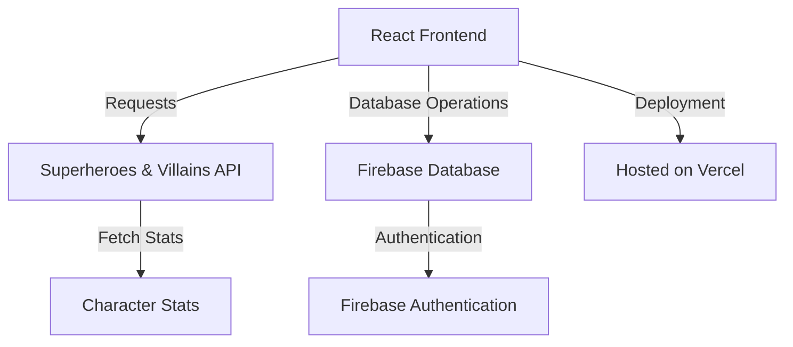
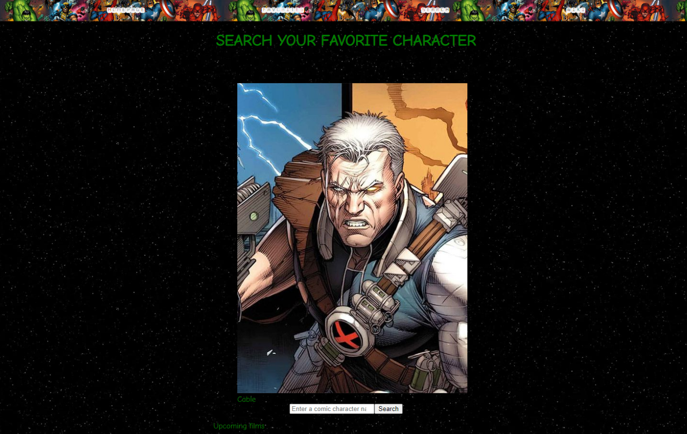
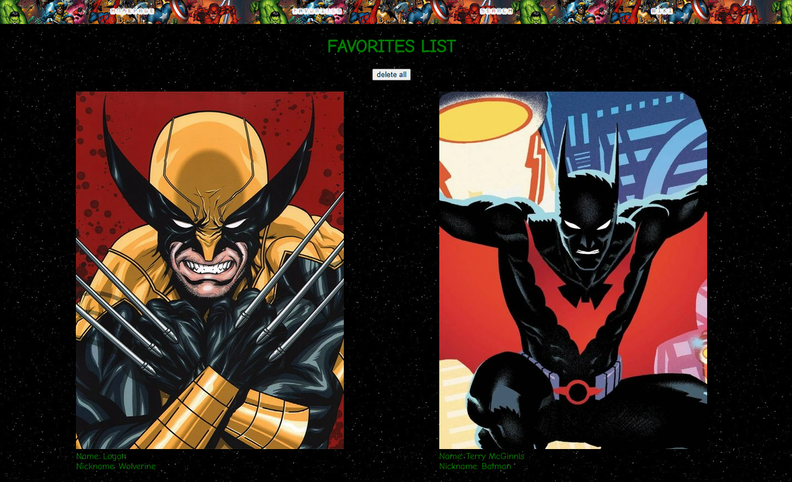

# 🦸‍♂️ Superheroes & Villains Search Engine

Welcome to my first web development project! 🎉

This is a search engine for superheroes and villains where you can:
- Explore the stats of various iconic characters.
- Add your favorites to a custom list.
- The app uses **Firebase** to store the favorites list persistently.
- Hosted on **Vercel** and performs API calls to fetch character data from an external API.

---

## 🚀 Demo

🌍 You can try the live app here: [Live Demo](https://hero-searcher.vercel.app)

---

## 🛠️ Technologies Used

This project was built using the following technologies and tools:

- **Frontend:**
  - [React.js](https://reactjs.org/) - Main framework for the user interface.
  - [CSS3](https://www.w3.org/Style/CSS/Overview.en.html) - Used for styling the application.

- **Backend & Database:**
  - [Firebase](https://firebase.google.com/) - NoSQL database and authentication.
  - [REST API](https://superheroapi.com/) - External API to fetch superhero data.

- **Hosting & Deployment:**
  - [Vercel](https://vercel.com/) - Used for deploying the app.

---

## 📐 Application Architecture

Below is a visual representation of the general architecture of the app:



The app follows a client-server architecture. **React** manages the user interface and client-side interactions. It performs `GET` requests to an external API to fetch character data. The favorites data is stored in **Firebase**, and user sessions are handled through Firebase Authentication. The app is deployed on **Vercel**.

---

## 🖥️ Screenshots

### Home Page



### Favorites Page



*(Add more screenshots if necessary)*

---

## 🔧 Installation & Setup

To clone and run this project locally, follow these steps:

1. Clone the repository:

   ```bash
   git clone https://github.com/your-username/repo-name.git
   ```

2. Navigate to the project directory:

   ```bash
   cd repo-name
   ```

3. Install the dependencies:

   ```bash
   npm install
   ```

4. Create a `.env` file and add your Firebase and API environment variables


5. Start the development server:

   ```bash
   npm start
   ```

6. Access the app at [http://localhost:3000](http://localhost:3000).

---

## 📋 Contribution Guidelines

Contributions are welcome! If you have suggestions or find bugs, feel free to open an [issue](https://github.com/enekomb/HeroSearcher/issues).
